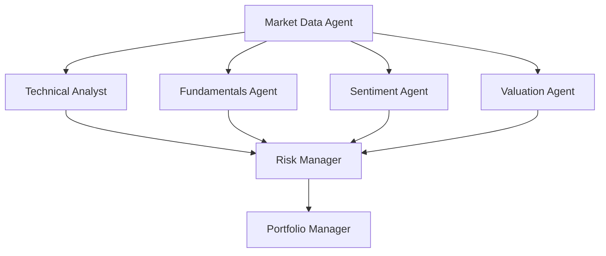

# AI Crypto Hedge Fund

This is a proof of concept for an AI-Created crypto hedge fund that analyzes DeFi trading data to make informed trading decisions. The system uses DexScreener API to gather real-time market data and employs a multi-'agent' architecture for comprehensive analysis. The app began using the OpenAi LLM for each agent's analysis. I used Windsurf to adapt this program to use DexScreener, and prompted it to change the agent's logic to better fit crypto assets. Instead of off loading logic to an LLM, Windurf decided to define its own logic in place. The reasoning it gave was that it would be more predictable and therefore more useful to track over time. This project is for **educational** purposes only and is not intended for real trading or investment.

## System Architecture

The system employs seven specialized agents working together in a coordinated workflow:



### Agent Descriptions

1. **Market Data Agent**
   ```mermaid
   graph LR
       A[DexScreener API] --> B[Get Pair Info]
       B --> C[Select Most Liquid Pair]
       C --> D[Extract Key Metrics]
       D --> E[Generate Summary]
   ```
   - Fetches real-time data from DexScreener API
   - Identifies the most liquid trading pair
   - Extracts key metrics: price, volume, liquidity, market cap
   - Provides standardized data format for other agents

2. **Technical Analyst**
   ```mermaid
   graph LR
       A[Price Data] --> B[Momentum Analysis]
       A --> C[Volume Analysis]
       A --> D[Buy/Sell Pressure]
       B & C & D --> E[Generate Signals]
   ```
   - Analyzes price momentum across multiple timeframes
   - Evaluates volume patterns and trends
   - Assesses buy/sell pressure ratios
   - Generates technical trading signals

3. **Fundamentals Agent**
   ```mermaid
   graph LR
       A[DEX Data] --> B[Liquidity Analysis]
       A --> C[Volume Analysis]
       A --> D[Price Movement]
       A --> E[Transaction Analysis]
       B & C & D & E --> F[Generate Signals]
   ```
   - Analyzes liquidity depth and stability
   - Evaluates trading volume patterns
   - Assesses price movements and volatility
   - Analyzes transaction patterns

4. **Sentiment Agent**
   ```mermaid
   graph LR
       A[Transaction Data] --> B[Pattern Analysis]
       A --> C[Price Impact]
       A --> D[Volume Trends]
       B & C & D --> E[Generate Signals]
   ```
   - Analyzes transaction patterns
   - Evaluates price impact of trades
   - Assesses volume trends
   - Generates market sentiment signals

5. **Valuation Agent**
   ```mermaid
   graph LR
       A[Market Data] --> B[MCap/TVL Analysis]
       A --> C[Volume/MCap Analysis]
       A --> D[Momentum Analysis]
       B & C & D --> E[Generate Signals]
   ```
   - Calculates Market Cap to TVL ratios
   - Evaluates Volume to Market Cap metrics
   - Assesses value based on momentum
   - Generates valuation signals

6. **Risk Manager**
   ```mermaid
   graph LR
       A[Market Data] --> B[Liquidity Risk]
       A --> C[Volatility Risk]
       A --> D[Transaction Risk]
       A --> E[Market Impact]
       B & C & D & E --> F[Position Limits]
   ```
   - Evaluates liquidity risks
   - Assesses volatility levels
   - Analyzes transaction risks
   - Calculates market impact
   - Sets position limits

7. **Portfolio Manager**
   ```mermaid
   graph LR
       A[Agent Signals] --> B[Weight Signals]
       B --> C[Risk Assessment]
       C --> D[Position Sizing]
       D --> E[Final Decision]
   ```
   - Aggregates signals from all agents
   - Applies signal weighting system
   - Considers risk parameters
   - Makes final trading decisions

## Setup

Clone the repository:
```bash
git clone https://github.com/virattt/ai-hedge-fund.git
cd ai-hedge-fund
```

1. Install Poetry (if not already installed):
```bash
curl -sSL https://install.python-poetry.org | python3 -
```

2. Install dependencies:
```bash
poetry install
```

3. Set up your environment variables:
```bash
# Create .env file
cp .env.example .env
```

## Usage

### Running the Hedge Fund

```bash
poetry run python src/main.py --token-address <TOKEN_ADDRESS> --chain-id <CHAIN_ID>
```

Example:
```bash
poetry run python src/main.py --token-address 0x0b3e328455c4059EEb9e3f84b5543F74E24e7E1b --chain-id base
```

You can also specify a `--show-reasoning` flag to print the reasoning of each agent to the console:

```bash
poetry run python src/main.py --token-address 0x0b3e328455c4059EEb9e3f84b5543F74E24e7E1b --chain-id base --show-reasoning
```

**Example Output:**
```
Market Data Summary:
{
  "price": "$0.2885",
  "market_cap": "$288,478,648.00",
  "24h_volume": "$11,247,665.99",
  "liquidity": "$32,979,750.88",
  "24h_change": "-12.27%",
  "trades_24h": "Buys: 3213, Sells: 906"
}

Technical Analysis:
{
  "momentum_signal": {
    "signal": "bullish",
    "details": "1h: 3.59%, 6h: 1.29%, 24h: -12.27%"
  },
  ...
}

...additional agent outputs...

### Updates as of 2025-01-01
- The system now integrates with the DexScreener API for real-time market data, providing insights into liquidity, trading volume, and price metrics.
- New agents have been added to enhance trading decision-making:
  - **Market Data Agent**: Fetches real-time data and identifies the most liquid trading pairs.
  - **Technical Analyst**: Analyzes price momentum and volume patterns to generate trading signals.
  - **Fundamentals Agent**: Evaluates liquidity, volume, and price movements to inform trading strategies.
  - **Risk Manager**: Assesses trading risks and sets position limits based on liquidity and volume analysis.
  - **Valuation Agent**: Performs valuation analysis using market cap and liquidity metrics.
- Example integration with InfluxDB for data storage and analysis has been demonstrated in `influx_example.py`.

## Project Structure 
```
ai-hedge-fund/
├── src/
│   ├── agents/                   # Agent definitions and workflow
│   │   ├── fundamentals.py       # Fundamental analysis for crypto
│   │   ├── market_data.py        # DexScreener data integration
│   │   ├── portfolio_manager.py  # Portfolio management
│   │   ├── risk_manager.py       # Crypto-specific risk management
│   │   ├── sentiment.py          # DEX sentiment analysis
│   │   ├── state.py              # Agent state management
│   │   ├── technicals.py         # Technical analysis
│   │   ├── valuation.py          # Crypto valuation metrics
│   ├── tools/                    # Agent tools
│   │   ├── dexscreener_api.py    # DexScreener API integration
│   ├── main.py                   # Main entry point
├── pyproject.toml
├── ...
```

## Features

- Real-time crypto market data from DexScreener
- Multi-timeframe analysis (1h, 6h, 24h)
- Comprehensive risk management
- Liquidity-aware position sizing
- Transaction pattern analysis
- Buy/sell pressure evaluation
- Market impact assessment

## Disclaimer

This project is for **educational and research purposes only**.

- Not intended for real trading or investment
- No warranties or guarantees provided
- Past performance does not indicate future results
- Creator assumes no liability for financial losses
- Consult a financial advisor for investment decisions

By using this software, you agree to use it solely for learning purposes.

## Contributing

1. Fork the repository
2. Create a feature branch
3. Commit your changes
4. Push to the branch
5. Create a Pull Request

## License

This project is licensed under the MIT License - see the LICENSE file for details.
